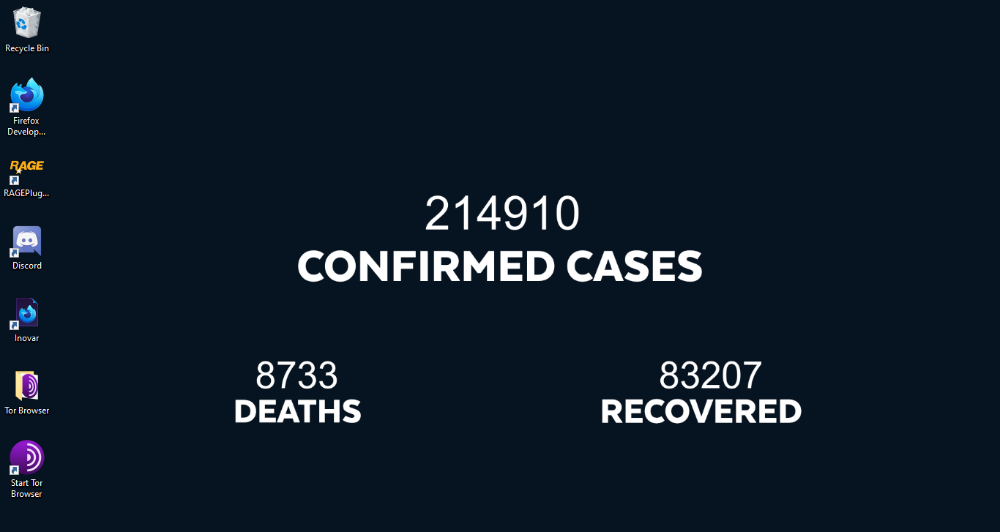
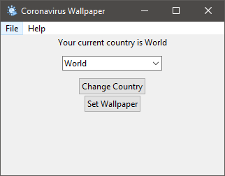

[](#contributors-) [](https://www.codefactor.io/repository/github/mm-coder/coronavirus-wallpaper)
# Coronavirus Wallpaper

This application creates gets the latest coronavirus statistics from [here](https://github.com/ExpDev07/coronavirus-tracker-api) and updates your wallpaper with them.

Currently ( & quite unfortunately) the project is windows-only

# Download

You can download the latest binaries from the [releases tab](https://github.com/MM-coder/coronavirus-wallpaper/releases)

## Screenshots:



## Developing
#### Requirements:
python3.8
git

```
git clone https://github.com/MM-coder/coronavirus-wallpaper.git
cd coronavirus-wallpaper
py main.py
```

## Building
#### Requirements:
python3.8
git
pyinstaller

```
git clone https://github.com/MM-coder/coronavirus-wallpaper.git
cd coronavirus-wallpaper
pyinstaller --onefile --add-data "./img";"img" -i img/virus.ico main.py
```


## Contributors ✨

Thanks goes to these wonderful people ([emoji key](https://allcontributors.org/docs/en/emoji-key)):

<!-- ALL-CONTRIBUTORS-LIST:START - Do not remove or modify this section -->
<!-- prettier-ignore-start -->
<!-- markdownlint-disable -->
<table>
  <tr>
    <td align="center"><a href="https://maurom.dev"><br /><sub><b>Mauro M.</b></sub></a><br /><a href="https://github.com/MM-coder/coronavirus-wallpaper/commits?author=MM-coder" title="Code">💻</a></td>
    <td align="center"><a href="https://that-guy.tech"><br /><sub><b>ThatGuy5275</b></sub></a><br /><a href="https://github.com/MM-coder/coronavirus-wallpaper/pulls?q=is%3Apr+reviewed-by%3AWallvon" title="Reviewed Pull Requests">👀</a></td>
    <td align="center"><a href="https://kamaropoulos.com"><br /><sub><b>Konstantinos Kamaropoulos</b></sub></a><br /><a href="https://github.com/MM-coder/coronavirus-wallpaper/commits?author=Kamaropoulos" title="Code">💻</a></td>
  </tr>
</table>

<!-- markdownlint-enable -->
<!-- prettier-ignore-end -->
<!-- ALL-CONTRIBUTORS-LIST:END -->

This project follows the [all-contributors](https://github.com/all-contributors/all-contributors) specification. Contributions of any kind welcome!

## License


The aforementioned code is protected and released to the public under the Creative Commons Attribution-NonCommercial-NoDerivatives 4.0 International (CC BY-NC-ND 4.0) License which can be viewed in license.md or on the Creative Commons website (https://creativecommons.org/licenses/by-nc-nd/4.0/). Any failure to comply with the terms designated in the license will be met with swift judicial action by the author.

By downloading, executing or otherwise transferring the code by any means you are legally bound to the terms stipulated in the license